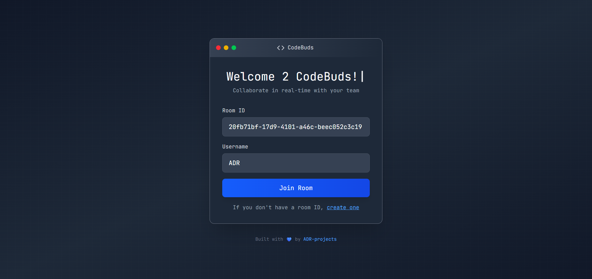
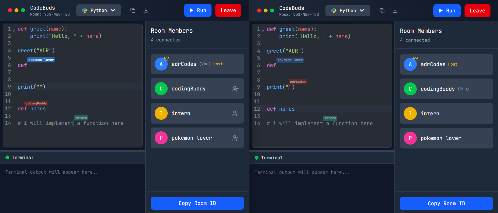

# CodeBuds - Code With Your Buddies!

A sleek real-time code collaboration web app with a MacBook-style interface. 

<!---->
   



<!--  -->


## Features

- **Real-time code collaboration:** Code together in sync
- **Code execution:** Run code and see output in a built-in terminal.
- **Cursor Syncing with colours:** See whose cursor is on the editor.
- **Multi-language compilation:** Run code in C, C++, C#, Java, Python, Rust, Javascript, Typescript, Ruby, Go and PHP!  

## Tech Stack

- **Frontend**: React
- **Backend**: Node.js + Express.js
<!--- **Database**: MongoDB -->
- **Real-time**: Socket.io
- **Code & Cursor Sync**: Codemirror v6
  
- **UI**: MacBook-inspired design

## Installation

```bash
# Clone the repository
git clone https://github.com/ADR-projects/CodeBuds.git
cd CodeBuds

# Install backend dependencies
cd backend
npm install

# Install frontend dependencies
cd client
npm install
```

## Usage

Add a .env file in root directory with:
```bash
PORT= # the port you wish to host backend on, default is 5000
```
Add a .env file in .client/:
```bash
VITE_APP_BACKEND_URL= # your backend URL
```

```bash 
# Start backend server
cd backend
npm run server

# Start frontend (in a new terminal)
cd client
npm run dev
```

## License

MIT License - see the [LICENSE](LICENSE) file for details.

## Note

This poroject has been hosted on vercel(frontend) and render(backend). When accessing the site, please wait some time for the backend to wake up!
Thank you!
